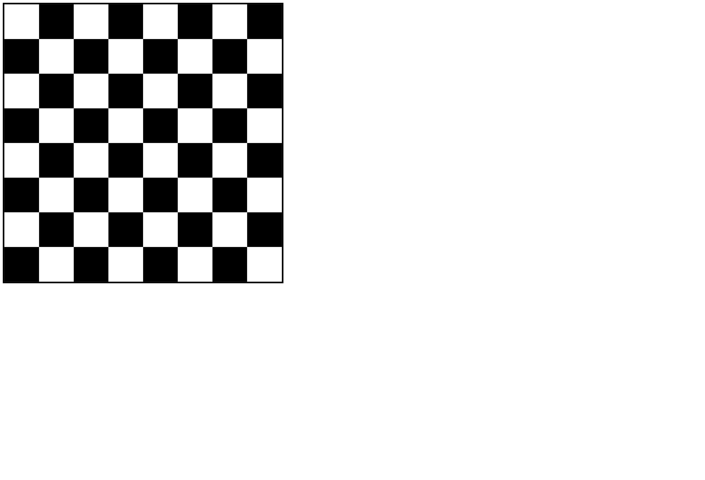

# Making Chessboard Using Basic HTML & CSS

Aplikasi ini menunjukan untuk membuat papan catur dengan basic HTML dan CSS. Untuk penggunaan display menggunakan block dan membuat kotak pada css dan tinggal berikan kelas white atau black.

## Cara menjalankan aplikasi
1. Clone repo ini
2. Buka index.html